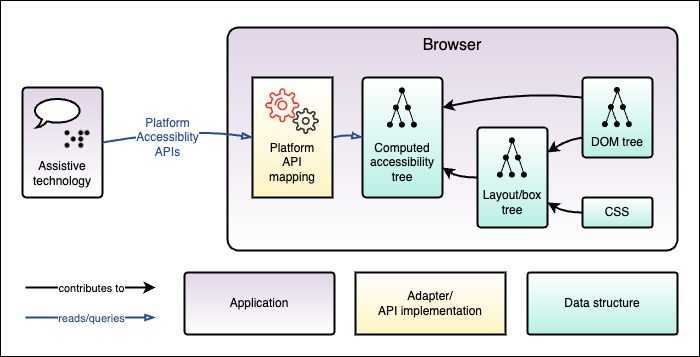
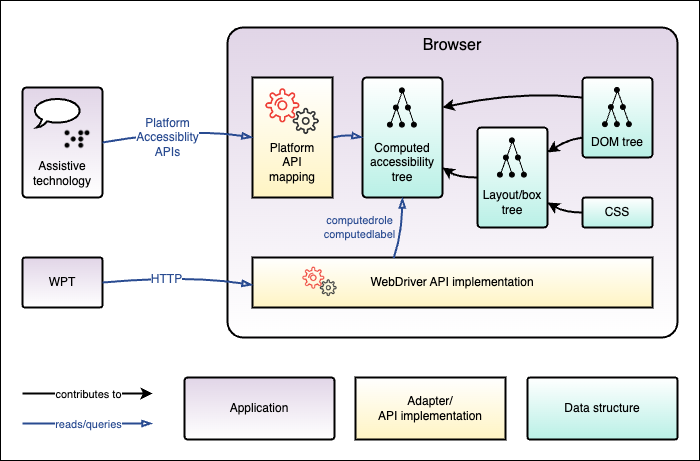
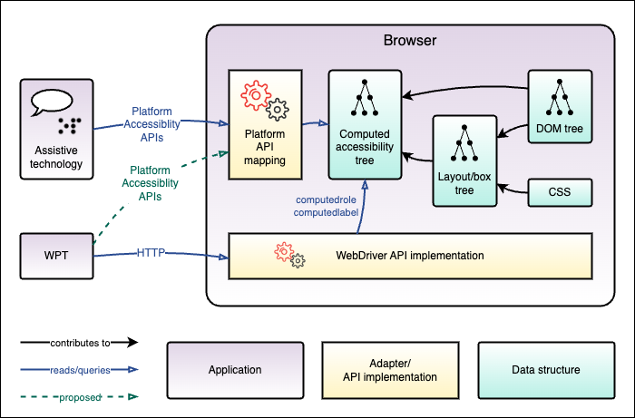

# RFC 204: WPT testing for AAMs

## Summary

Extend WPT with the ability to test Accessibility APIs exposed by browsers.

The Accessibility API Mapping (AAM) specifications
([Core-AAM](https://www.w3.org/TR/core-aam-1.2/),
[HTML-AAM](https://www.w3.org/TR/html-aam-1.0/),
[SVG-AAM](https://www.w3.org/TR/svg-aam-1.0/), potentially
[MathML-AAM](https://w3c.github.io/mathml-aam/),
[CSS-AAM](https://w3c.github.io/css-aam/)) describe how user agents
should expose semantics of web content languages to accessibility
APIs. These documents, taken together, describe how the browser should
build an accessibility tree for each web page, and how the tree should
be mapped to various accessibility platform APIs.

## Details

<h3>Background: Computed Accessibility Tree, Platform Accessibility APIs and the AAMs</h3>

#### The Accessibility Tree and Accessibility APIs

Full image description

A block diagram.

At the top level it shows an assistive technology application, such as
a screen reader using speech or braille, communicating via Platform
Accessibility APIs with a Browser application.

Within the Browser application, it shows that the Assistive Technology
is communicating via a Platform API mapping which is an adapter for
the computed accessibility tree data structure.  In turn, the computed
accessibility tree is built based on other data structures: the DOM
tree and the layout/box tree; the layout/box tree is based on the DOM
tree and CSS.

The computed accessibility tree falls in the center of the diagram, as
it's the source of truth for the platform API mappings which are
queried by assistive technology, and also the result of a complex
process of transformation based on several other data structures.

At the bottom of the diagram is a legend explaining how to read the
different types of arrows and boxes used in the diagram.

Assistive technologies (ATs) query the browser via platform
accessibility APIs. These are operating system-specific APIs which
provide detailed information about an application's UI state for the
purpose of augmenting the user experience for users with disabilities
which affect their ability to perceive or operate the standard UI.

One example of a commonly used AT is a screen reader, which assists
users with vision impairments by providing a spoken version of the UI.
Typically, a screen reader user will navigate through the UI by
traversing the page and "visiting" UI elements, hearing a spoken
description of each such as "Overview, heading level 2" or "Core-AAM,
link".

The accessibility APIs allow this by making extensive data available
about the UI, in the form of a tree structure referred to as the
"accessibility tree".  The accessibility tree provides information
about each UI element (often corresponding to a DOM node), allowing
screen readers to provide these spoken descriptions.  Each platform's
accessibility APIs provide methods to query the tree structure, and
the information available for each node.

They also typically provide ways to interact with the UI, such as
sending a "click" action to the currently visited UI element, or
selecting a particular option from a picker.  Also, they provide ways
for the UI to provide real-time updates or alerts in case of UI
changing in a way that should be brought to the user's attention.

#### The computed accessibility tree

Since browser engines are typically platform-independent, typically they will compute a generic accessibility tree which can be adapted to any platform's accessibility APIs.
The platform APIs are typically supported using an adapter which maps the platform API on to data from the computed accessibility tree.

#### AAM specifications

The AAM specifications provide mappings between web technologies such as ARIA and HTML, and platform accessibility APIs.

For example, here is the mapping from Core-AAM for an Element with [`aria-checked=true`](https://w3c.github.io/core-aam/#ariaCheckedTrue)

<table>
  <tbody>
    <tr>
      <th><abbr title="Microsoft Active Accessibility">MSAA</abbr> + IAccessible2 </th>
      <td>
        State: <code>STATE_SYSTEM_CHECKED</code> 
        Object Attribute: <code>checkable:true</code>
      </td>
    </tr>
    <tr>
      <th><abbr title="User Interface Automation">UIA</abbr></th>
      <td>
        Property: <code>Toggle.ToggleState</code>: <code>On (1)</code> 
        Property: <code>SelectionItem.IsSelected</code>: <code>True</code> for <code>radio</code> and <code>menuitemradio</code>
      </td>
    </tr>
    <tr>
      <th><abbr title="Accessibility Toolkit">ATK</abbr>/<abbr title="Assistive Technology-Service Provider Interface">AT-SPI</abbr></th>
      <td>
        State: <code>STATE_CHECKABLE</code> 
        State: <code>STATE_CHECKED</code>
      </td>
    </tr>
    <tr>
      <th><abbr title="macOS Accessibility Protocol">AX API</abbr></th>
      <td>
        Property: <code>AXValue</code>: <code>1</code> 
        Property: <code>AXMenuItemMarkChar</code>: <code>✓</code> for <code>menuitemcheckbox</code> and <code>menuitemradio</code>
      </td>
    </tr>
  </tbody>
</table>

And here is the mapping from HTML-AAM for a [`<button>`](https://www.w3.org/TR/html-aam-1.0/#el-button):

<table>
  <tbody>
    <tr>
      <th><abbr title="HyperText Markup Language">HTML</abbr> Specification</th>
      <td>
        <a data-type="element" href="https://html.spec.whatwg.org/multipage/form-elements.html#the-button-element"><code>button</code></a>
      </td>
    </tr>
    <tr>
      <th>[<cite><a class="bibref" data-link-type="biblio" href="#bib-wai-aria-1.2" title="Accessible Rich Internet Applications (WAI-ARIA) 1.2">wai-aria-1.2</a></cite>]</th>
      <td><a class="core-mapping" href="https://www.w3.org/TR/core-aam-1.2/#role-map-button"><code>button</code></a> role</td>
    </tr>
    <tr>
      <th><a href="https://www.w3.org/TR/core-aam-1.2/#roleMappingComputedRole">Computed Role</a></th>
      <td class="role-computed">
Use <abbr title="Accessible Rich Internet Applications">WAI-ARIA</abbr> mapping
</td>
    </tr>
    <tr>
      <th>
        <a href="https://msdn.microsoft.com/en-us/library/dd373608%28v=VS.85%29.aspx"><abbr title="Microsoft Active Accessibility">MSAA</abbr></a> + <a href="http://accessibility.linuxfoundation.org/a11yspecs/ia2/docs/html/">IAccessible2</a>
      </th>
      <td>
        
Use <abbr title="Accessible Rich Internet Applications">WAI-ARIA</abbr> mapping

      </td>
    </tr>
    <tr>
      <th><a href="https://msdn.microsoft.com/en-us/library/ms726297%28v=VS.85%29.aspx">UIA</a></th>
      <td>
        
Use <abbr title="Accessible Rich Internet Applications">WAI-ARIA</abbr> mapping

      </td>
    </tr>
    <tr>
      <th><a href="https://gnome.pages.gitlab.gnome.org/atk/">ATK</a></th>
      <td>
        
Use <abbr title="Accessible Rich Internet Applications">WAI-ARIA</abbr> mapping

      </td>
    </tr>
    <tr>
      <th><a href="https://developer.apple.com/reference/appkit/nsaccessibility">AX</a></th>
      <td>
        
Use <abbr title="Accessible Rich Internet Applications">WAI-ARIA</abbr> mapping

      </td>
    </tr>
    <tr>
      <th>Comments</th>
      <td>
        A <code>button</code>'s mapping will change if the
        <a class="core-mapping" href="https://www.w3.org/TR/core-aam-1.2/#role-map-button-pressed"><code>aria-pressed</code></a> or <a class="core-mapping" href="https://www.w3.org/TR/core-aam-1.2/#role-map-button-haspopup"><code>aria-haspopup</code></a> attributes are specified.
      </td>
    </tr>
  </tbody>
</table>

<h3>Prior art: Get Computed Label, Get Computed Role, potential WebDriver extensions</h3>

Full image description

A block diagram.

This diagram extends the <a
href="#user-content-accessibility_apis_diagram">diagram in the
"accessibility tree and accessibility APIs" section</a>, showing how
the WPT application can query the browser's Webdriver API
implementation to request the computed role and computed label for an
element.

It adds a block for the WPT application to the left of the Browser application,
below the assistive technology application block,
and a block within the Browser application for the WebDriver API implementation.

Where the assistive technology application queries the Platform API Mapping
via platform accessibility APIs,
the WPT application queries the WebDriver API implementation via HTTP.

Like the Platform API mapping adapter,
the WebDriver API implementation also queries the computed accessibility tree.

WebDriver and testharness.js support getting the computed
accessibility
[label](https://www.w3.org/TR/webdriver2/#get-computed-label) and
[role](https://www.w3.org/TR/webdriver2/#get-computed-role) for a
particular element.  This allows testing the two core properties for
nodes in the computed, platform-independent accessibility tree,
verifying that the first step of the process for supporting the
platform accessibility APIs has been successfully completed for those
properties.

Computing the platform-independent role is supported in the AAMs,
particularly in HTML-AAM, by the addition to each mapping table of a
"computed" row in addition to the platform-specific API rows. In the
`<button>` example above, in fact, every API and the "Computed"
mapping all defer to the WAI-ARIA mapping for the `"button"`
role. When no equivalent ARIA role exists, the HTML element name with
a prefix of `html-` is used, as in the mapping for
[`<canvas>`](https://www.w3.org/TR/html-aam-1.0/#el-canvas).

Name computation, meanwhile, is complex and important enough to get a
whole spec to itself: [Accessible Name and Description
Computation](https://www.w3.org/TR/accname-1.2/) - as well as
[detailed steps for certain HTML
elements](https://www.w3.org/TR/html-aam-1.0/#accname-computation).

#### Potential WebDriver extensions for accessibility

There is [a proposal](https://github.com/WICG/aom/issues/203) to add an extension to WebDriver
to allow accessing a full "computed accessibility node" for an element.

This would allow fetching a much more extensive set of computed accessibility properties for an element via WebDriver.
Like Computed Label and Computed Role, these would be querying the platform-independent, computed accessibility tree.

#### First attempt at AAM tests in WPT: Extending testharness.js

The first version of this proposal create a [proof of concept PR on WPT to extend
testharness.js](https://github.com/web-platform-tests/wpt/pull/53733).
The POC added new endpoint to test_driver which will take a set of
asserts and execute them against the accessibility APIs in the python
layer. It worked on Mac, Windows and Linux.

The main downsides where that:
1. The logic of the test (what was executed against accessibility APIs) was far from the test writing. The logic to execute a test was under the /tools directory, but a test author would add a new tests in the core-aam/ directory. In order to write a test that tested a API different then what had been test before, you would need to update the executors under /tools. As a work around, we discussed having python in a string that was sent to the backend to execute, which also didn't seem ideal.
2. The tests did not have their own test type.

Technical Details:
- Adding a set of platform-specific `ExecutorImpl` classes,
  [`AtspiExecutorImpl`](https://github.com/Igalia/wpt/pull/2/files#diff-9247f1aa2fe3d167af87ee04c48bc3ceb244d3de5040fdf97cdb129e05fa47e4) and
  [`AXAPIExecutorImpl`](https://github.com/Igalia/wpt/pull/2/files#diff-a52eb168f8a233c8e81ba15c97691a7ac144e3168a3bfbd2c6c80ece5ab55c58) (so far),
  which can:
  - find the browser application's root accessibility node
  - find the root accessibility node for the browser's active tab
  - find the accessibility node corresponding to a particular DOM ID
  - serialize an accessibility node into a JSON string
- Adding a `PlatformAccessibilityProtocolPart` class in a new file,
  [`executors/executorplatformaccessibility.py`](https://github.com/Igalia/wpt/pull/2/files#diff-4136e59af143c98357cb7a6153da10afc1fde0c16a657194efd31b1b4edd4f50),
  extending `ProtocolPart` and providing one protocol method,
  `get_accessibility_api_node(self, dom_id)`.
  - Unlike the other `ProtocolPart`s, `PlatformAccessibilityProtocolPart`
    provides its own, canonical implementation for its protocol method,
    and is **not** listed in `protocol.py`
  - During its `setup()`, `PlatformAccessibilityProtocolPart`
    instantiates the appropriate platform-specific accessibility API executor class:
    `AtspiExecutorImpl` for Linux, and `AXAPIExecutorImpl` for Mac and `WindowsAccessibilityExecutorImpl`
    for Windows.
  - When `get_accessibility_api_node()` is called, the platform-specific Executor's
    `get_accessibility_api_node()` implementation is used to serialize the relevant
    accessibility information into a JSON string.
  - We may eventually decide a more granular API is preferable;
    `get_accessibility_api_node()` was the easiest to use to write a proof-of-concept test
- Importing the `PlatformAccessibilityProtocolPart` class into
  [`executorwebdriver.py`](https://github.com/Igalia/wpt/pull/2/files#diff-e5a8911dd97e0352b1b26d8ce6ef0a92b25378f7c9e79371a1eb1b1834bc9a8d) and
  [`executormarionette.py`](https://github.com/Igalia/wpt/pull/2/files#diff-df97e1990f484c82b8d8a34baf584d01761bfd98386beb69fac702edb31003a3),
  adding it to the list of `implements` `ProtocolPart`s for
  `MarionetteProtocol` and `WebDriverProtocol`.
- [Adding a `GetAccessibilityAPINodeAction`](https://github.com/Igalia/wpt/pull/2/files#diff-57303393b05825acd5eb3124fb15dd5c9f9b996eb898b659fbb3676fc247a8f3) class
  in `executors/actions.py`,
  which calls into `protocol.platform_accessibility.get_accessibility_api_node()`
- [Extending `testdriver-extra.js`](https://github.com/Igalia/wpt/pull/2/files#diff-46aeeb40b0a0c13031b151392ca70a17614295533d3e890c0cb4360cb3b91542)
  to add a `get_accessibility_api_node()` method,
  which runs a `"get_accessibility_api_node"` action
- [Extending `testdriver.js`](https://github.com/Igalia/wpt/pull/2/files#diff-1fe2b624679a3150e5c86f84682c5901b715dad750096a524e8cb23939e5590f)
  to add a `get_accessibility_api_node()` method,
  which calls into `test_driver_internal`'s `get_accessibility_api_node()` method
  - See "Extending `testdriver.js`" below
- Adding a [proof-of-concept Testharness test](https://github.com/Igalia/wpt/pull/2/files#diff-4c6cae4648eadb186a175370e04a9e9581664a469c60fdb72d0d20600b28adeb),
  which uses the new `get_accessibility_api_node` to get the platform-specific role
  for a particular element.

### Proposal: testing AAMs via platform accessibility APIs directly

Full image description

A block diagram.

This diagram extends the <a
href="#user-content-webdriver_accessibility_diagram">diagram in the
"Prior art" section</a>.

It adds a dotted line arrow from the WPT application to the Platform
API mapping adapter within the Browser application, indicating the
addition proposed here to use the Platform Accessibility APIs directly
to test the browser's support for those APIs.

Notably, while the existing mechanism for WPT to query the browser via
WebDriver communicates with the WebDriver API implementation within
the browser via HTTP, the proposed addition bypasses WebDriver to
query the Platform API Mapping directly via Platform Accessibility
APIs.  This matches the way that Assistive Technology communicates
with the browser application.  

As described in the "Prior Art" section above, we think testing the
computed accessibility tree is extremely useful in itself, and a good
fit for the platform-independent nature of browser testing and
WebDriver specifically.  It provides a good foundation for ensuring
that the first stage of accessibility API mapping for web features has
been implemented, since in almost every case browsers will need to
implement the cross-platform tree as a prerequisite for implementing
the platform-specific APIs.

This proposal focuses on an equally important goal, directly testing
that each browser's platform API support conforms to the AAM
specifications. The easiest and most reliable way to test that is to
use the APIs directly, matching the way that assistive technology
communicates with the browser.

An alternative would be to extend WebDriver to mirror each platform API's vocabulary.
This would involve a great deal of work to specify how those vocabularies should be expressed
through WebDriver and testdriver,
and implementation work to implement those APIs and test the implementation,
before we could even write any tests using the WebDriver version.

<h3>Example: computed role vs. platform API mapping for <code>&lt;input type="password"&gt;</code>
</h3>

The table below is excerpted from the <a href="https://www.w3.org/TR/html-aam-1.0/#el-input-password" id="el-input-password">HTML-AAM mapping for `input` (`type` attribute in the Password state)</a>:

<table aria-labelledby="el-input-password">
  <tbody>
    <tr>
      <th>[<cite><a class="bibref" data-link-type="biblio" href="#bib-wai-aria-1.2" title="Accessible Rich Internet Applications (WAI-ARIA) 1.2">wai-aria-1.2</a></cite>]</th>
      <td>No corresponding role</td>
    </tr>
    <tr>
      <th><a href="https://www.w3.org/TR/core-aam-1.2/#roleMappingComputedRole">Computed Role</a></th>
      <td class="role-computed">
html-input-password
</td>
    </tr>
    <tr>
      <th>
        <a href="https://msdn.microsoft.com/en-us/library/dd373608%28v=VS.85%29.aspx"><abbr title="Microsoft Active Accessibility">MSAA</abbr></a> + <a href="http://accessibility.linuxfoundation.org/a11yspecs/ia2/docs/html/">IAccessible2</a>
      </th>
      <td>
        
Role: <code>ROLE_SYSTEM_TEXT</code>

        
States: <code>STATE_SYSTEM_PROTECTED</code>; <code>IA2_STATE_SINGLE_LINE</code>; <code>STATE_SYSTEM_READONLY</code> if readonly, otherwise <code>IA2_STATE_EDITABLE</code>

      </td>
    </tr>
    <tr>
      <th><a href="https://msdn.microsoft.com/en-us/library/ms726297%28v=VS.85%29.aspx">UIA</a></th>
      <td>
        
Control Type: <code>Edit</code>

        
Localized Control Type: <code>"password"</code>

        
Other properties: Set <code>isPassword</code> to <code>true</code>

      </td>
    </tr>
    <tr>
      <th><a href="https://gnome.pages.gitlab.gnome.org/atk/">ATK</a></th>
      <td>
        
Role: <code>ATK_ROLE_PASSWORD_TEXT</code>

        
States: <code>ATK_STATE_SINGLE_LINE</code>; <code>ATK_STATE_READ_ONLY</code> if readonly, otherwise <code>ATK_STATE_EDITABLE</code>

      </td>
    </tr>
    <tr>
      <th><a href="https://developer.apple.com/reference/appkit/nsaccessibility">AX</a></th>
      <td>
        
AXRole: <code>AXTextField</code>

        
AXSubrole: <code>AXSecureTextField</code>

        
AXRoleDescription: <code>"secure text field"</code>

      </td>
    </tr>
  </tbody>
</table>

Since each platform accessibility API has its own vocabulary and its own conceptual framework,
the concept of "password field" is expressed differently in each API.

Where the computed accessibility tree on each platform would contain a node
with the role `"html-input-password"`,
the browser would need to adapt that computed role to each platform API correctly
in order for users of the assistive technologies which query those APIs
to be able to use the browser.

# Test Design

We have an [PR open on WPT for a new test
type `aamtest`](https://github.com/web-platform-tests/wpt/pull/53733) which is
modeled after `wdspec` tests and re-uses some of the same classes and
python test fixture.

## Test files

Like the `wdspec` tests, a test file is a python file. Each file
represents a mapping table in one of the AAMs including: (1) some html
markup, and (2) a subtest for each accessibility API. The WPT
webdriver client implementation is used to load HTML into the
browser. The accessibility APIs are provide via pytest fixtures. On
platforms where the subtest does not apply, the "PRECONDITION_FAILED"
test result is used.

## Ensuring accessibility is enabled in the browser

The introduction of the new test type allows us to restart the browser
when the wptrunner enounters the `aamtest`, or a test other than the
`aamtest`. When the next test is an `aamtest`, the browser is started
with accessibility enabled. When it leaves `aamtests`, the browser is
restarted without accessibility enabled.

Firefox and Chrome both allow for the accessibility to be enabled from
a CLI argument. Safari does not yet, but there is a [PR to add this
functionality in the
works](https://github.com/WebKit/WebKit/pull/56965). Until this PR
lands, Safari will not support this test type.

## Finding the browser through the accessibility API

In order to query the browser application via accessibility APIs, we
need a reliable way to find the correct browser application. We can do
this by the application name (which means only one browser instance
can run at a time) or by PID. To run the test by PID, we need to get
the PID of the browser.

Geckodriver exposes the PID in the capabilities as `moz:processID` and
Chromedriver exposes it as `goog:processID`. Safaridriver does not
expose the ID, until they do, testing Safari cannot be
parallelized (as only one safari instance can run in order to find it
by name in the accessibility API).

Valerie has filed [an issue](https://github.com/w3c/webdriver/issues/1823)
on WebDriver to propose adding a mechanism to request the browser PID,
potentially through the `capabilities` object used when creating a Session.

## Risks

These test might be slow to to run. The browser is noticeably slower
when accessibility features are turn on (when the browser builds the
accessibility tree).  Additionally, the browser can't run in headless
mode.

The tests may be flaky due to timing issues with the accessibility
tree being built. The accessibility tree lags behind the DOM and even
paint, with no feedback available to the page about what the status of
the accessibility tree is.  The webdriver computed name/computed role
APIs sidestep this issue, since they build the accessibility tree on
demand.

These tests introduce platform specific tests and results, which
increase the complexity of WPT.

