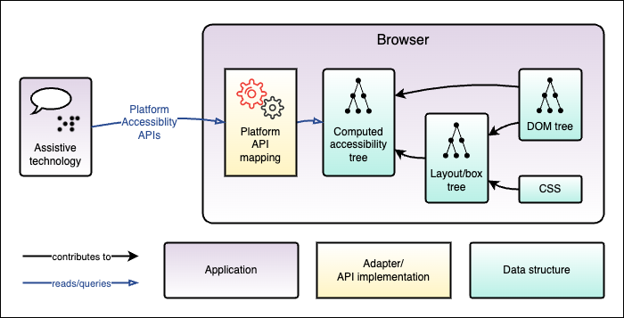

# RFC 203: WPT testing for AAMs

## Summary

We're proposing extending WPT infrastructure to allow testharness tests to test browsers' interaction with accessibility APIs.

This extension will allow us to test several W3C specifications that have no cross-browser test suites and will therefore greatly improve the web for individuals who use assistive technologies like screen readers.

Adding these capabilities would likely involve:
- adding one or more actions in `testdriver.js` to request data from platform accessibility APIs
- implementing those actions in `wptrunner` using Python bindings for those APIs
- adding dependencies on the Python bindings for each platform's accessibility API(s).

## Details

The Accessibility API Mapping (AAM) specifications ([Core-AAM](https://www.w3.org/TR/core-aam-1.2/), [HTML-AAM](https://www.w3.org/TR/html-aam-1.0/), [SVG-AAM](https://www.w3.org/TR/svg-aam-1.0/), potentially [MathML-AAM](https://w3c.github.io/mathml-aam/), [CSS-AAM](https://w3c.github.io/css-aam/)) describe how user agents should expose semantics of web content languages to accessibility APIs.

These documents, taken together, describe how the browser should build an accessibility tree for each web page, and how the tree should be mapped to various accessibility platform APIs.

The goal of this extension is to add tests for these specifications to WPT.

<details>
<summary><h3>Background: Computed Accessibility Tree, Platform Accessibility APIs and the AAMs</h3></summary>

#### The Accessibility Tree and Accessibility APIs


<details id="accessibility_apis_diagram">
<summary>Full image description</summary>
A block diagram.

At the top level it shows an assistive technology application, such as a screen reader using speech or braille, communicating via Platform Accessibility APIs with a Browser application.

Within the Browser application, it shows that the Assistive Technology is communicating via a Platform API mapping which is an adapter for the computed accessibility tree data structure.
In turn, the computed accessibility tree is built based on other data structures: the DOM tree and the layout/box tree; the layout/box tree is based on the DOM tree and CSS.

The computed accessibility tree falls in the center of the diagram, as it's the source of truth for the platform API mappings which are queried by assistive technology, and also the result of a complex process of transformation based on several other data structures.

At the bottom of the diagram is a legend explaining how to read the different types of arrows and boxes used in the diagram.
</details>

Assistive technologies (ATs) query the browser via platform accessibility APIs. These are operating system-specific APIs which provide detailed information about an application's UI state for the purpose of augmenting the user experience for users with disabilities which affect their ability to perceive or operate the standard UI.

One example of a commonly used AT is a screen reader, which assists users with vision impairments by providing a spoken version of the UI.
Typically, a screen reader user will navigate through the UI by traversing the page and "visiting" UI elements, hearing a spoken description of each such as "Overview, heading level 2" or "Core-AAM, link".

The accessibility APIs allow this by making extensive data available about the UI, in the form of a tree structure referred to as the "accessibility tree".
The accessibility tree provides information about each UI element (often corresponding to a DOM node), allowing screen readers to provide these spoken descriptions.
Each platform's accessibility APIs provide methods to query the tree structure, and the information available for each node.

They also typically provide ways to interact with the UI, such as sending a "click" action to the currently visited UI element, or selecting a particular option from a picker.
Also, they provide ways for the UI to provide real-time updates or alerts in case of UI changing in a way that should be brought to the user's attention.

#### The computed accessibility tree

Since browser engines are typically platform-independent, typically they will compute a generic accessibility tree which can be adapted to any platform's accessibility APIs.
The platform APIs are typically supported using an adapter which maps the platform API on to data from the computed accessibility tree.

#### AAM specifications

The AAM specifications provide mappings between web technologies such as ARIA and HTML, and platform accessibility APIs.

For example, here is the mapping from Core-AAM for an Element with [`aria-checked=true`](https://w3c.github.io/core-aam/#ariaCheckedTrue)

<table>
  <tbody>
    <tr>
      <th><abbr title="Microsoft Active Accessibility">MSAA</abbr> + IAccessible2 </th>
      <td>
        <span>State: <code>STATE_SYSTEM_CHECKED</code></span><br>
        <span>Object Attribute: <code>checkable:true</code></span>
      </td>
    </tr>
    <tr>
      <th><abbr title="User Interface Automation">UIA</abbr></th>
      <td>
        <span>Property: <code>Toggle.ToggleState</code>: <code>On (1)</code></span><br>
        <span>Property: <code>SelectionItem.IsSelected</code>: <code>True</code> for <code>radio</code> and <code>menuitemradio</code></span>
      </td>
    </tr>
    <tr>
      <th><abbr title="Accessibility Toolkit">ATK</abbr>/<abbr title="Assistive Technology-Service Provider Interface">AT-SPI</abbr></th>
      <td>
        <span>State: <code>STATE_CHECKABLE</code></span><br>
        <span>State: <code>STATE_CHECKED</code></span>
      </td>
    </tr>
    <tr>
      <th><abbr title="macOS Accessibility Protocol">AX API</abbr></th>
      <td>
        <span>Property: <code>AXValue</code>: <code>1</code></span><br>
        <span>Property: <code>AXMenuItemMarkChar</code>: <code>✓</code> for <code>menuitemcheckbox</code> and <code>menuitemradio</code></span>
      </td>
    </tr>
  </tbody>
</table>

And here is the mapping from HTML-AAM for a [`<button>`](https://www.w3.org/TR/html-aam-1.0/#el-button):

<table>
  <tbody>
    <tr>
      <th><abbr title="HyperText Markup Language">HTML</abbr> Specification</th>
      <td>
        <a data-type="element" href="https://html.spec.whatwg.org/multipage/form-elements.html#the-button-element"><code>button</code></a>
      </td>
    </tr>
    <tr>
      <th>[<cite><a class="bibref" data-link-type="biblio" href="#bib-wai-aria-1.2" title="Accessible Rich Internet Applications (WAI-ARIA) 1.2">wai-aria-1.2</a></cite>]</th>
      <td><a class="core-mapping" href="https://www.w3.org/TR/core-aam-1.2/#role-map-button"><code>button</code></a> role</td>
    </tr>
    <tr>
      <th><a href="https://www.w3.org/TR/core-aam-1.2/#roleMappingComputedRole">Computed Role</a></th>
      <td class="role-computed"><div class="general">Use <abbr title="Accessible Rich Internet Applications">WAI-ARIA</abbr> mapping</div></td>
    </tr>
    <tr>
      <th>
        <a href="https://msdn.microsoft.com/en-us/library/dd373608%28v=VS.85%29.aspx"><abbr title="Microsoft Active Accessibility">MSAA</abbr></a> + <a href="http://accessibility.linuxfoundation.org/a11yspecs/ia2/docs/html/">IAccessible2</a>
      </th>
      <td>
        <div class="general">Use <abbr title="Accessible Rich Internet Applications">WAI-ARIA</abbr> mapping</div>
      </td>
    </tr>
    <tr>
      <th><a href="https://msdn.microsoft.com/en-us/library/ms726297%28v=VS.85%29.aspx">UIA</a></th>
      <td>
        <div class="general">Use <abbr title="Accessible Rich Internet Applications">WAI-ARIA</abbr> mapping</div>
      </td>
    </tr>
    <tr>
      <th><a href="https://gnome.pages.gitlab.gnome.org/atk/">ATK</a></th>
      <td>
        <div class="general">Use <abbr title="Accessible Rich Internet Applications">WAI-ARIA</abbr> mapping</div>
      </td>
    </tr>
    <tr>
      <th><a href="https://developer.apple.com/reference/appkit/nsaccessibility">AX</a></th>
      <td>
        <div class="general">Use <abbr title="Accessible Rich Internet Applications">WAI-ARIA</abbr> mapping</div>
      </td>
    </tr>
    <tr>
      <th>Comments</th>
      <td>
        A <code>button</code>'s mapping will change if the
        <a class="core-mapping" href="https://www.w3.org/TR/core-aam-1.2/#role-map-button-pressed"><code>aria-pressed</code></a> or <a class="core-mapping" href="https://www.w3.org/TR/core-aam-1.2/#role-map-button-haspopup"><code>aria-haspopup</code></a> attributes are specified.
      </td>
    </tr>
  </tbody>
</table>

</details>

<details>
<summary><h3>Prior art: Get Computed Label, Get Computed Role, potential WebDriver extensions</h3></summary>


<details id="webdriver_accessibility_diagram">
<summary>Full image description</summary>
A block diagram.

This diagram extends the <a href="#user-content-accessibility_apis_diagram">diagram in the "accessibility tree and accessibility APIs" section</a>,
showing how the WPT application can query the browser's Webdriver API implementation
to request the computed role and computed label for an element.

It adds a block for the WPT application to the left of the Browser application,
below the assistive technology application block,
and a block within the Browser application for the WebDriver API implementation.

Where the assistive technology application queries the Platform API Mapping
via platform accessibility APIs,
the WPT application queries the WebDriver API implementation via HTTP.

Like the Platform API mapping adapter,
the WebDriver API implementation also queries the computed accessibility tree.
</details>

WebDriver and testharness.js support getting the computed accessibility [label](https://www.w3.org/TR/webdriver2/#get-computed-label) and [role](https://www.w3.org/TR/webdriver2/#get-computed-role) for a particular element.
This allows testing the two core properties for nodes in the computed, platform-independent accessibility tree, verifying that the first step of the process for supporting the platform accessibility APIs has been successfully completed for those properties.

Computing the platform-independent role is supported in the AAMs, particularly in HTML-AAM, by the addition to each mapping table of a "computed" row in addition to the platform-specific API rows. In the `<button>` example above, in fact, every API and the "Computed" mapping all defer to the WAI-ARIA mapping for the `"button"` role. When no equivalent ARIA role exists, the HTML element name with a prefix of `html-` is used, as in the mapping for [`<canvas>`](https://www.w3.org/TR/html-aam-1.0/#el-canvas).

Name computation, meanwhile, is complex and important enough to get a whole spec to itself: [Accessible Name and Description Computation](https://www.w3.org/TR/accname-1.2/) - as well as [detailed steps for certain HTML elements](https://www.w3.org/TR/html-aam-1.0/#accname-computation).

#### Potential WebDriver extensions for accessibility

There is [a proposal](https://github.com/WICG/aom/issues/203) to add an extension to WebDriver
to allow accessing a full "computed accessibility node" for an element.

This would allow fetching a much more extensive set of computed accessibility properties for an element via WebDriver.
Like Computed Label and Computed Role, these would be querying the platform-independent, computed accessibility tree.

</details>

### Proposal: testing AAMs via platform accessibility APIs directly


<details>
<summary>Full image description</summary>
A block diagram.

This diagram extends the <a href="#user-content-webdriver_accessibility_diagram">diagram in the "Prior art" section</a>.

It adds a dotted line arrow from the WPT application to the Platform API mapping adapter within the Browser application, indicating the addition proposed here to use the Platform Accessibility APIs directly to test the browser's support for those APIs.

Notably, while the existing mechanism for WPT to query the browser via WebDriver
communicates with the WebDriver API implementation within the browser via HTTP,
the proposed addition bypasses WebDriver to query the Platform API Mapping directly via Platform Accessibility APIs.
This matches the way that Assistive Technology communicates with the browser application.
</details>

As described in the "Prior Art" section above, we think testing the computed accessibility tree is extremely useful in itself,
and a good fit for the platform-independent nature of browser testing and WebDriver specifically.
It provides a good foundation for ensuring that
the first stage of accessibility API mapping for web features has been implemented,
since in almost every case browsers will need to implement the cross-platform tree
as a prerequisite for implementing the platform-specific APIs.

This proposal focuses on an equally important goal, directly testing that each browser's platform API support conforms to the AAM specifications. The easiest and most reliable way to test that is to use the APIs directly, matching the way that assistive technology communicates with the browser.

An alternative would be to extend WebDriver to mirror each platform API's vocabulary.
This would involve a great deal of work to specify how those vocabularies should be expressed
through WebDriver and testdriver,
and implementation work to implement those APIs and test the implementation,
before we could even write any tests using the WebDriver version.

<details>
<summary><h3>Example: computed role vs. platform API mapping for <code>&lt;input type="password"&gt;</code>
</h3>
</summary>

The table below is excerpted from the <a href="https://www.w3.org/TR/html-aam-1.0/#el-input-password" id="el-input-password">HTML-AAM mapping for `input` (`type` attribute in the Password state)</a>:

<table aria-labelledby="el-input-password">
  <tbody>
    <tr>
      <th>[<cite><a class="bibref" data-link-type="biblio" href="#bib-wai-aria-1.2" title="Accessible Rich Internet Applications (WAI-ARIA) 1.2">wai-aria-1.2</a></cite>]</th>
      <td>No corresponding role</td>
    </tr>
    <tr>
      <th><a href="https://www.w3.org/TR/core-aam-1.2/#roleMappingComputedRole">Computed Role</a></th>
      <td class="role-computed"><div class="general">html-input-password</div></td>
    </tr>
    <tr>
      <th>
        <a href="https://msdn.microsoft.com/en-us/library/dd373608%28v=VS.85%29.aspx"><abbr title="Microsoft Active Accessibility">MSAA</abbr></a> + <a href="http://accessibility.linuxfoundation.org/a11yspecs/ia2/docs/html/">IAccessible2</a>
      </th>
      <td>
        <div class="role"><span class="type">Role:</span> <code>ROLE_SYSTEM_TEXT</code></div>
        <div class="states"><span class="type">States:</span> <code>STATE_SYSTEM_PROTECTED</code>; <code>IA2_STATE_SINGLE_LINE</code>; <code>STATE_SYSTEM_READONLY</code> if readonly, otherwise <code>IA2_STATE_EDITABLE</code></div>
      </td>
    </tr>
    <tr>
      <th><a href="https://msdn.microsoft.com/en-us/library/ms726297%28v=VS.85%29.aspx">UIA</a></th>
      <td>
        <div class="ctrltype"><span class="type">Control Type:</span> <code>Edit</code></div>
        <div class="properties"><span class="type">Localized Control Type:</span> <code>"password"</code></div>
        <div class="properties"><span class="type">Other properties: </span>Set <code>isPassword</code> to <code>true</code></div>
      </td>
    </tr>
    <tr>
      <th><a href="https://gnome.pages.gitlab.gnome.org/atk/">ATK</a></th>
      <td>
        <div class="role"><span class="type">Role:</span> <code>ATK_ROLE_PASSWORD_TEXT</code></div>
        <div class="states"><span class="type">States:</span> <code>ATK_STATE_SINGLE_LINE</code>; <code>ATK_STATE_READ_ONLY</code> if readonly, otherwise <code>ATK_STATE_EDITABLE</code></div>
      </td>
    </tr>
    <tr>
      <th><a href="https://developer.apple.com/reference/appkit/nsaccessibility">AX</a></th>
      <td>
        <div class="role"><span class="type">AXRole:</span> <code>AXTextField</code></div>
        <div class="subrole"><span class="type">AXSubrole:</span> <code>AXSecureTextField</code></div>
        <div class="roledesc"><span class="type">AXRoleDescription:</span> <code>"secure text field"</code></div>
      </td>
    </tr>
  </tbody>
</table>

Since each platform accessibility API has its own vocabulary and its own conceptual framework,
the concept of "password field" is expressed differently in each API.

Where the computed accessibility tree on each platform would contain a node
with the role `"html-input-password"`,
the browser would need to adapt that computed role to each platform API correctly
in order for users of the assistive technologies which query those APIs
to be able to use the browser.
</details>

## Proof-of-concept patch

We have an [experimental patch](https://github.com/Igalia/wpt/pull/2/files)
which implements a proof-of-concept for using platform APIs
(currently AT-SPI on Linux, the macOS Accessibility Protocol and MSAA/IAccessible2
on windows) to query browsers under test and make assertions about their accessibility implementations.

This patch works by:
- Adding a set of platform-specific `ExecutorImpl` classes,
  [`AtspiExecutorImpl`](https://github.com/Igalia/wpt/pull/2/files#diff-9247f1aa2fe3d167af87ee04c48bc3ceb244d3de5040fdf97cdb129e05fa47e4) and
  [`AXAPIExecutorImpl`](https://github.com/Igalia/wpt/pull/2/files#diff-a52eb168f8a233c8e81ba15c97691a7ac144e3168a3bfbd2c6c80ece5ab55c58) (so far),
  which can:
  - find the browser application's root accessibility node
  - find the root accessibility node for the browser's active tab
  - find the accessibility node corresponding to a particular DOM ID
  - serialize an accessibility node into a JSON string
- Adding a `PlatformAccessibilityProtocolPart` class in a new file,
  [`executors/executorplatformaccessibility.py`](https://github.com/Igalia/wpt/pull/2/files#diff-4136e59af143c98357cb7a6153da10afc1fde0c16a657194efd31b1b4edd4f50),
  extending `ProtocolPart` and providing one protocol method,
  `get_accessibility_api_node(self, dom_id)`.
  - Unlike the other `ProtocolPart`s, `PlatformAccessibilityProtocolPart`
    provides its own, canonical implementation for its protocol method,
    and is **not** listed in `protocol.py`
  - During its `setup()`, `PlatformAccessibilityProtocolPart`
    instantiates the appropriate platform-specific accessibility API executor class:
    `AtspiExecutorImpl` for Linux, and `AXAPIExecutorImpl` for Mac and `WindowsAccessibilityExecutorImpl`
    for Windows.
  - When `get_accessibility_api_node()` is called, the platform-specific Executor's
    `get_accessibility_api_node()` implementation is used to serialize the relevant
    accessibility information into a JSON string.
  - We may eventually decide a more granular API is preferable;
    `get_accessibility_api_node()` was the easiest to use to write a proof-of-concept test
- Importing the `PlatformAccessibilityProtocolPart` class into
  [`executorwebdriver.py`](https://github.com/Igalia/wpt/pull/2/files#diff-e5a8911dd97e0352b1b26d8ce6ef0a92b25378f7c9e79371a1eb1b1834bc9a8d) and
  [`executormarionette.py`](https://github.com/Igalia/wpt/pull/2/files#diff-df97e1990f484c82b8d8a34baf584d01761bfd98386beb69fac702edb31003a3),
  adding it to the list of `implements` `ProtocolPart`s for
  `MarionetteProtocol` and `WebDriverProtocol`.
- [Adding a `GetAccessibilityAPINodeAction`](https://github.com/Igalia/wpt/pull/2/files#diff-57303393b05825acd5eb3124fb15dd5c9f9b996eb898b659fbb3676fc247a8f3) class
  in `executors/actions.py`,
  which calls into `protocol.platform_accessibility.get_accessibility_api_node()`
- [Extending `testdriver-extra.js`](https://github.com/Igalia/wpt/pull/2/files#diff-46aeeb40b0a0c13031b151392ca70a17614295533d3e890c0cb4360cb3b91542)
  to add a `get_accessibility_api_node()` method,
  which runs a `"get_accessibility_api_node"` action
- [Extending `testdriver.js`](https://github.com/Igalia/wpt/pull/2/files#diff-1fe2b624679a3150e5c86f84682c5901b715dad750096a524e8cb23939e5590f)
  to add a `get_accessibility_api_node()` method,
  which calls into `test_driver_internal`'s `get_accessibility_api_node()` method
  - See "Extending `testdriver.js`" below
- Adding a [proof-of-concept Testharness test](https://github.com/Igalia/wpt/pull/2/files#diff-4c6cae4648eadb186a175370e04a9e9581664a469c60fdb72d0d20600b28adeb),
  which uses the new `get_accessibility_api_node` to get the platform-specific role
  for a particular element.

Some extra implementation details:
- Threading [`Product.name`](https://github.com/web-platform-tests/wpt/blob/db43136df5ed567566e1b57bb715ca1582138afd/tools/wptrunner/wptrunner/products.py#L22)
  from `wptrunner.run_test_interation()` through to the relevant `Protocol` subclasses
  ([`WebDriverProtocol`](https://github.com/Igalia/wpt/pull/2/files#diff-e5a8911dd97e0352b1b26d8ce6ef0a92b25378f7c9e79371a1eb1b1834bc9a8dR448) and
  [`MarionetteProtocol`](https://github.com/Igalia/wpt/pull/2/files#diff-df97e1990f484c82b8d8a34baf584d01761bfd98386beb69fac702edb31003a3R766)),
  where it can be
  [read by `PlatformAccessibilityProtocolPart`](https://github.com/Igalia/wpt/pull/2/files#diff-4136e59af143c98357cb7a6153da10afc1fde0c16a657194efd31b1b4edd4f50R23)
  and passed to the platform-specific `ExecutorImpl`
  - See "Getting the browser PID" below
- Threading a `--force_renderer_accessibility` argument from the
  [WPT command line](https://github.com/Igalia/wpt/pull/2/files#diff-a9049174d0964d96a0664440110a1f081edc89601a3caa9d52209a6af24e4f5d)
  to the [Chrome](https://github.com/Igalia/wpt/pull/2/files#diff-0bfb8dd5978f182d6fc8ba9e085c743dd6ae9d76fcbd1aa326e9b0aa9bf3a829R522)
  command line

<details>
<summary><h3>Open questions on technical implementations and test design</h3>
</summary>

The patch includes all relevant technologies and the basic steps necessary to test the platform-specific accessibility APIs. However, there are some open design questions which we would love feedback on.

#### Adding dependencies on the Python bindings for the platform APIs

We use [comtypes](https://pypi.org/project/comtypes/) on Windows,
[PyGObject](https://pygobject.gnome.org/index.html) on Linux,
and [pyobjc-framework-ApplicationServices](https://pypi.org/project/pyobjc-framework-ApplicationServices/) and [pyobjc-framework-Accessibility](https://pypi.org/project/pyobjc-framework-Accessibility/) on macOS.

How do we ensure that WPT users have these libraries available?

#### Using the `testharness` test type rather than some new thing

We definitely want to be able to _use_ `testdriver.js` and `testharness{,report}.js` in our tests,
since we want to be able to use WebDriver's automation functionality to interact with the page,
and we don't want to invent a new form of testing from scratch.

However, we're wondering whether it might make sense to define a new test type
for these tests which are interacting with the browser locally via the platform accessibility APIs,
rather than via WebDriver.
This would also allow us to start browsers with the appropriate command-line arguments/environment (e.g. `--force-renderer-accessibility` for Chromium-based browsers, `GNOME_ACCESSILBITY=1` for Firefox on Linux).

What would be involved in defining a new test type which can still use that existing infrastructure?

#### `GetAccessibilityAPINodeAction`/`PlatformAccessibilityProtocolPart` design

`executorplatformaccessibility.py` both defines and implements `PlatformAccessibilityProtocolPart`.
This allows it to instantiate the appropriate platform-specific platform accessibility executor implementation.

It's then imported into executors which provide their own implementations of
the pure-virtual `ProtocolPart` classes in `protocol.py`:

`executors/executorwebdriver.py`:
```py
from .executorplatformaccessibility import (PlatformAccessibilityProtocolPart)

class WebDriverProtocol(Protocol):
    implements = [WebDriverBaseProtocolPart,
                  ...,
                  PlatformAccessibilityProtocolPart]
```

This allows `CallbackHandler` in `executors/base.py` to use the `GetAccessibilityAPINodeAction`
like any other action in `actions.py`,
since it doesn't need to define a separate `Protocol`:

`executors/actions.py`:
```py
class GetAccessibilityAPINodeAction:
    name = "get_accessibility_api_node"

    def __init__(self, logger, protocol):
        self.logger = logger
        self.protocol = protocol

    def __call__(self, payload):
        dom_id = payload["dom_id"]
        return self.protocol.platform_accessibility.get_accessibility_api_node(dom_id)
```

`executors/base.py`:
```py
from .actions import actions

# Instantiated in do_testharness in executor{marionette,webdriver}, passing in
# {Marionette,WebDriver}Protocol instances respectively
class CallbackHandler:
    """Handle callbacks from testdriver-using tests.

    The default implementation here makes sense for things that are roughly like
    WebDriver. Things that are more different to WebDriver may need to create a
    fully custom implementation."""

    def __init__(self, logger, protocol, test_window):
        self.protocol = protocol
        self.actions = {cls.name: cls(self.logger, self.protocol) for cls in actions}
```

Does it make sense to piggy-back off the other `Protocol` implementations in this way?

`actions.py` has this comment:

```py
class CallbackHandler:
    """Handle callbacks from testdriver-using tests.

    The default implementation here makes sense for things that are roughly like
    WebDriver. Things that are more different to WebDriver may need to create a
    fully custom implementation."""
```

#### Per-platform tests

Is there an existing way to write platform-specific tests?

Our proof-of-concept test has only one sub-test, and it has assertions for each of the supported platforms.

It may be that we don't always have that level of correspondence between platforms for what we need to test.
It may also simply be more convenient to write individual tests per platform,
rather than requiring each test to include assertions for each platform.

In particular, if we end up having a more granular API than `get_accessibility_api_node()` returning a bag of properties,
we may want to avoid needing to do the type of OS check we do in this test (via `node.API`),
so that we can call the more granular, platform-specific APIs knowing that they will be available in that context.

We're very much still figuring out how the eventual tests might be structured,
but if there's already a way to run specific tests based on the platform,
that would be good to know.

#### [Getting the browser PID](https://github.com/w3c/webdriver/issues/1823)

In order to query the browser application via accessibility APIs,
we need a reliable way to find the correct browser application.
The [proof of concept](https://github.com/Igalia/wpt/pull/2/files)
uses the application name;
however this creates obvious problems if you're trying to use a particular browser
at the same time as WPT is running a separate instance of the same browser for testing.

So far, the best way we've found is to use the process ID;
this allows us to unambiguously find the browser process under test.
However, since WPT often doesn't start browsers directly,
but uses an automation tool like Marionette or ChromeDriver,
we can't always get the process ID of the browser easily from WPT.

Valerie has filed [an issue](https://github.com/w3c/webdriver/issues/1823)
on WebDriver to propose adding a mechanism to request the browser PID,
potentially through the `capabilities` object used when creating a Session.

</details>

## Risks

These test might be slow to to run. The browser is noticeably slower when accessibility features are turn on (when the browser builds the accessibility tree).
Additionally, the browser can't run in headless mode.

The tests may be flaky due to timing issues with the accessibility tree being built. The accessibility tree lags behind the DOM and even paint, with no feedback available to the page about what the status of the accessibility tree is.
The webdriver computed name/computed role APIs sidestep this issue, since they build the accessiblity tree on demand.

These tests introduce platform specific tests and results, which increase the complexity of WPT.

